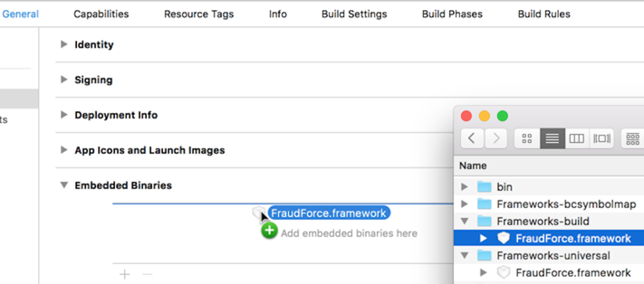
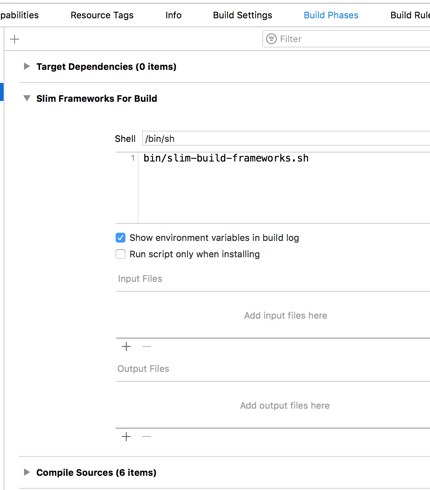
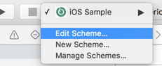
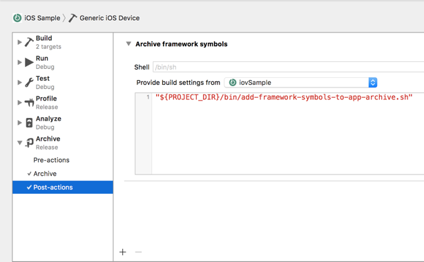

Title: iovation FraudForce SDK for iOS

FraudForce SDK for iOS
===========================

iovation identifies devices through information collected by an SDK run
on an end-user’s mobile device. The FraudForce SDK inspects the device
and generates a blackbox that contains all available device information. This
blackbox must then be sent to your servers to be used in a transaction risk
check via the `CheckTransactionDetails` API.

The FraudForce SDK integrates with native and hybrid apps. Hybrid apps
mix native code with content that runs inside web view.

Integration Files and Requirements
----------------------------------

|                     |                                                       |
|---------------------|-------------------------------------------------------|
| File                | `FraudForce.framework`                                |
| Version             | 5.0.2                                                 |
| Required OS Version | iOS 9.0 and higher                                    |
| Supported Devices   | iPhone 4S & up, iPod Touch 5th Gen & up, iPad 2 & up  |
| Required Frameworks | CoreTelephony, Security, SystemConfiguration          |
| Optional Frameworks | AdSupport, CoreLocation                               |

Installation
------------

1.  Download and unzip the SDK from [Github](https://github.com/iovation/deviceprint-SDK-iOS).

2.  Bring the universal framework into your project repository.
    *   Create a new directory named "Frameworks-universal". We recommend this directory be located alongside the app's `.xcodeproj` file.
    *   Copy `FraudForce.framework` from the SDK distribution into your "Frameworks-universal" directory.

3.  Prepare the staging area for build-specific frameworks.
    *   Create a new directory, alongside the universal directory, named "Frameworks-build".
    *   Inside of Frameworks-build, create a new directory named "FraudForce.framework".
        *   This is not intended to (initially) be a valid framework, rather just an empty directory that has the `.framework` extension.

4.  In the Finder, drag `FraudForce.framework` **from Frameworks-build** into the "Embedded Binaries" section of the "General" pane of the Xcode target editor.

     

    *   This should also result in the framework being added to the "Linked Frameworks and Libraries" section.
    *   Additionally, this should result in `FraudForce.framework` appearing in similarly named sections in the "Build Phases" pane.

5.  Optionally add these frameworks (i.e. "Linked Frameworks and Libraries") if your app makes use of them (and Auto Linking is off):
    *   `AdSupport.framework` — If your app displays ads. Do not include if your
        app does not use the ad framework, because the App Store will reject
        apps that include the framework but don't use it.
    *   `CoreLocation.framework` — If your app uses location monitoring. Do not
        include this framework unless your application requests geolocation
        permission from the user.

6.  Add a pre-compile build phase to your application target
    *   Copy the shell script `slim-build-frameworks.sh` from the SDK distribution (`FraudForce SDK/build scripts`) into your project repository.
    *   Select the "+" button in the "Build Phases" pane to create a "New Run Script Phase".
        *   The new phase is initially named "Run Script" and is positioned as the bottom-most (final) build phase.
        *   The suggested name for this phase is "Slim Frameworks For Build" (though the name does not affect the function of this phase).
    *   Reposition the new phase to precede the "Compile Sources" phase.
        *   Under normal conditions, this will result in the phase being located below "Target Dependencies".

        

    * Configure and confirm the new build phase
        *   The "Shell" text field should read "/bin/sh" (which is the default value).
        *   In the text-input area, enter the project-relative path to the iovation-provided script `slim-build-frameworks.sh`.
    *   Ensure that the initial environment variables within this script are set to appropriate values (i.e. those established in the above steps).
        *   Specifically, `INPUT_FRAMEWORKS_DIR` (Frameworks-universal) and `OUTPUT_FRAMEWORKS_DIR` (Frameworks-build) variables must be set to the absolute paths for the appropriate directories.
        *   As provided, the script expects both directories to be located alongside the app's `.xcodeproj` file.

7.  If your app has enabled the "Keychain Sharing" capability:
    *   Add "com.iovation.stm" to its list of Keychain Groups
    *   Add the key `AppIdentifierPrefix` with the string value
        `$(AppIdentifierPrefix)` to your app's `Info.plist`.

8.  For Xcode 10 (and above), allow FraudForce to collect wireless network information:
    *   Configure your app to include the "Access WiFi Information" capability.
    *   Turning the capability on for your application target in Xcode 10 (and above) will update the app's entitlements file and provisioning profile.
        *   This entitlement is not required for (and breaks automatic code signing of) apps built by earlier versions of Xcode. 

Submission Preparation
-----------------------

The FraudForce framework provides full support for Apple's bitcode technology. If your iOS app includes 
bitcode then additional configuration of your Xcode project is required to enable symbolication of FraudForce 
stack frames in the crash logs of your app. The necessary symbolic information must be included in the 
Xcode archive (i.e. `.xcarchive` bundle) of your application prior to its submission to the App Store.

1.  Bring the framework `.bcsymbolmap` files into your project repository.
    *   Create a new directory named "Frameworks-bcsymbolmap". We recommend this directory be located alongside the app's `.xcodeproj` file.
    *   Copy the `.bcsymbolmap` files from the SDK distribution (`FraudForce SDK/BCSymbolMaps`) into your "Frameworks-bcsymbolmap" directory.
        *   There should be three such files (representing armv7, armv7s, and arm64 architectures).

2.  Add a script to the "Archive" scheme of your application target.
    *   Copy the shell script `add-framework-symbols-to-app-archive.sh` from the SDK distribution (`FraudForce SDK/build scripts`) into your project repository.
    *   From the target popup button in the Xcode toolbar, ensure your application target is selected and chose "Edit Scheme…" from the popup menu.

         

    *   In the scheme editor, select the disclosure triangle for the "Archive" item and then select "Post-actions".
        *   Select the "+" button in order to create a "New Run Script Action".
        *   The new action is initially named "Run Script". The suggested name for this action is "Archive Framework Symbols" (though the name does not affect the function of this action).

        

    * Configure and confirm the new script action.
        *   The "Shell" text field should read "/bin/sh" (which is the default value).
        *   The "Provide build settings from" popup button should be set to the application target.
        *   In the text-input area, enter the absolute path to the iovation-provided script `add-framework-symbols-to-app-archive.sh`.
            *   For example, if the script is located in a `bin` directory that is alongside the app's `.xcodeproj` file then it should read, `"${PROJECT_DIR}/bin/add-framework-symbols-to-app-archive.sh"`
            *   The quotes are an important concern, since this allows for proper execution when path elements include spaces.

3.  Ensure that the initial environment variables within this script are set to appropriate values (i.e. those established in both the above steps and in the [Installation] section).
    *   Specifically, `BUILD_FRAMEWORKS_DIR` (Frameworks-build) and `INPUT_BCSYMBOLMAP_DIR` (Frameworks-bcsymbolmap) variables must be set to the absolute paths for the appropriate directories.
    *   As provided, the script expects both directories to be located alongside the app's `.xcodeproj` file.

4.  (optional) Customize the logging of script output as you desire.
    *   By default, Xcode does not handle or display output from scheme-based scripts, thus, the script redirects `stdout` and `stderr` to a (unique) log file in `/var/tmp`.
    *   Change the output redirection or ignore all script output by removing redirection (which is declared near the start of the script).

Sample Projects
---------------

This download includes two sample Xcode projects that demonstrate the integration of the FraudForce 
SDK for iOS. These projects require at least Xcode 8 and iOS 9.0.

* The `iovSample/iovSampleSwift.xcodeproj` project uses Swift to demonstrate 
two integration techniques: UIKit and WebKit. Each is implemented in its own 
view controller, and may be tested in a tabbed interface on a simulator or device.

* The `iovSample/iovSample.xcodeproj` project uses Objective-C to demonstrate 
two integration techniques: UIKit and WebKit. Each is implemented in its own 
view controller, and may be tested in a tabbed interface on a simulator or device.

Usage
-----

Use the `FraudForce` API to enable the FraudForce SDK to start collecting blackbox
data asynchronously, and to generate a new blackbox to submit to your back-end service.

1.  Import it into your app delegate and call `+start` when the application
    becomes active:

        [FraudForce start];

    This method starts a low-priority thread that silently collects data from
    the device with minimal impact on your app.

2.  Include your "Subscriber Key" in your application's `Info.plist`, using the key `IOVSubKey`.

        <key>IOVSubKey</key>
        <string>6S7EJX4BM7HuKUmriUOuQvXta9mBUs4tAVtGToP6tUY=</string>

    This is strongly recommended for all integrations, and it is required for network connections.

3.  (optional) Provide a `FraudForceDelegate` object, which is required for network connections.

        - (BOOL)application:(UIApplication *)application didFinishLaunchingWithOptions:(NSDictionary *)launchOptions 
        {
            [FraudForce delegation:self];
    …

        - (BOOL)shouldEnableNetworkCalls
        {
            return YES;
        }

3.  To generate a new blackbox, call `+blackbox`:

        NSString *blackbox = [FraudForce blackbox];

4.  Submit the blackbox to your service. The service should then send
    it to iovation to evaluate the transaction. See the iovSample Xcode
    projects included with the download for a sample implementation.

### New Features! ###

Versions 5.0.0 and above include the ability to make a network call to iovation's service. This 
enables the FraudForce SDK to collect additional network information. By default this functionality 
is turned off and will need to be enabled via a `FraudForceDelegate` object. Usage of this 
feature requires a subscriber key be provided. Please contact your iovation client representative to 
acquire a subscriber key.

### Important! ###

The blackbox returned from `+blackbox` should never be empty. An empty blackbox 
indicates there is a problem with the integration of the SDK or that the protection 
offered by the system may have been compromised.

Asynchronous Processing Integration
-----------------------------------

Each of the native and hybrid integration methods described below benefit
from starting the SDK asynchronous processing whenever your application
becomes active. To do so, import `FraudForce` and call `+start` in the
`-applicationDidBecomeActive:` method of your app delegate:

    #import "SampleAppDelegate.h"
    @import FraudForce;

    -applicationDidBecomeActive:(UIApplication *)application
    {
        [FraudForce start];
    }

The `+start` method automatically registers a notification handler to be
called when the application goes into the background. This handler asks the
OS for time to finish any tasks it has running.

Integrating Into Native Apps
----------------------------

To integrate into a native app using UIKit:

1.  Start the asynchronous data collection as described in the
    [Asynchronous Processing Integration] section.

1. Import `FraudForce` and call `+blackbox` wherever you need a blackbox:

        #import "SampleViewController.h"
        @import FraudForce;

        @implementation SampleViewController
        @property (strong, nonatomic) UILabel *blackbox;

        // Button press updates text field with blackbox value
        - (IBAction)changeMessage:(id)sender
        {
            self.blackbox.text = [FraudForce blackbox];
        }

        @end

A more extensive example, including submitting a blackbox in an HTTP request,
may be found in the `SampleUIKitViewController` class for both Swift (iovSampleSwift) and 
Objective-C (iovSample) in the sample Xcode projects included in the FraudForce SDK download.

WebKit Integration
------------------

For a hybrid application using [WebKit], create a JavaScript message handler
and add it to the context of the web view.

1.  Start the asynchronous data collection as described in the
    [Asynchronous Processing Integration] section.

2.  Build a view controller that implements the WKScriptMessageHandler
    protocol. Here’s an example in Swift:

        import UIKit
        import WebKit
        import FraudForce

        class SampleWebKitViewController: UIViewController, WKScriptMessageHandler
        {
            weak var webView: WKWebView?

            override func viewDidLoad() {
                super.viewDidLoad()
                // Set up Blackbox.injectInto() via a user script.
                var js = "var Blackbox = { injectInto: function (id) {\n"
                       + "    window.webkit.messageHandlers.bb.postMessage(id)\n"
                       + " } }\n"
                let userScript = WKUserScript(
                    source: js, 
                    injectionTime: .atDocumentEnd, 
                    forMainFrameOnly: true)

                // Set up bb notification.
                let userContentController = WKUserContentController()
                userContentController.addUserScript(userScript)
                userContentController.add(self, name: "bb")
                let configuration = WKWebViewConfiguration()
                configuration.userContentController = userContentController

                // Create the web view.
                let webKitView = WKWebView(frame: self.view.bounds, configuration: configuration)
                self.view.addSubview(webKitView)
                webKitView.translatesAutoresizingMaskIntoConstraints = true
                webKitView.autoresizingMask = [.flexibleHeight, .flexibleWidth]
                webView = webKitView
            }
        }

    In this example, we added a script handler called "bb" and appointed the
    view controller itself as the delegate. The `Blackbox.injectInto()`
    function calls into this handler.

3.  To hook up this script handler, add the following method to handle
    notifications from JavaScript running in the web view. This example
    assumes that an HTML ID for a hidden form field will be passed in the
    message body:

        func userContentController(
            _ userContentController: WKUserContentController,
            didReceive message: WKScriptMessage)
        {
            // Consider checking properties of message.webView.URL, such as the host
            // property, to ensure that it's a request from a known source.
            guard message.name == "bb" else {
                return
            }

            // Inject the blackbox.
            message.webView?.evaluateJavaScript(
                "document.getElementById('\(message.body)').value = '\(FraudForce.blackbox())'", 
                completionHandler: nil)
        }

    The last statement simply injects the blackbox from a call to
    `FraudForce.blackbox()` into the hidden form field. Consider adding code
    to check the domain and other attributes of the requesting web page to
    ensure it is allowed to have a blackbox.

4.  Then, invoke `FraudForce.injectinfo()` function any place in the HTML
    that you need a blackbox:

        <form name="txn" onsubmit="try { FraudForce.injectInto('bbox'); } catch(e) {} return true;">
            <input type="hidden" id="bbox" name="bbox" />
            <!-- Other fields as required --->
            <input type="submit" />
        </form>

    **NOTE:** The `try`/`catch` statement ignores errors if none of the
    `FraudForce.injectInto` object hierarchy exists. This is essential if
    the HTML will be used outside of your app.

5.  If you have full control over the HTML that will be loaded into
    WKWebView, including the name of a hidden field into which to inject a
    blackbox, append the code to inject the blackbox to the user script.
    Change the JavaScript variable declaration above to:

        var js = "var Blackbox = { injectInto: function (id) {\n"
               + "    window.webkit.messageHandlers.bb.postMessage(id)\n"
               + " } }\n"
               + "document.getElementById('bbox').value = '\(FraudForce.blackbox())'\n"

Find a complete example in the `SampleWKWebViewViewController` class for Swift (iovSampleSwift) and `SampleWebKitViewController` 
class for Objective-C (iovSample) in the sample Xcode projects included in the FraudForce SDK download.

[Intelligence Center]: https://admin.iovation.com/
[the SDK]: https://github.com/iovation/deviceprint-SDK-iOS
[Installation]: #installation
[Usage]: #usage
[Asynchronous Processing Integration]: #asynchronousprocessingintegration
[Integrating Into Native Apps]: #integratingintonativeapps
[WebKit]: https://developer.apple.com/documentation/webkit "WebKit Framework Reference"

Changes
-------

### v5.0.2 ###
* Minor recognition improvements.
* Updated the iovSample project (Objective-C) to the latest language, project, and system standards.
    * Removed the UIWebView integration sample.
* Minor improvements to the iovSampleSwift project.
* Note a new entitlement is recommended for apps built with Xcode 10 (and above). See the [Installation steps](#entitle-wireless) for details.

### v5.0.1 ###
* Minor recognition improvements.
    * Recognized devices previously returned (via `CheckTransactionDetails`) the following attributes
        * `mobile.app.procName`
        * `mobile.system.voipAllowed`
    * These values are no longer returned. In place of `mobile.app.procName`, use `mobile.app.exeName` which returns the same value.

### v5.0.0 ###
* New SDK distribution format, `FraudForce.framework` supersedes the `iovation.framework`.
  The new framework employs a dynamic library (in place of the historical "static archive" approach),
  which is the modern, recommended (iOS 8 and above), and more stable approach for library distribution.
* New ability to collect additional network information. See "New Features!" in the [Usage] section.
* New blackbox compression on iOS (up to 40% reduction in blackbox size).
* Improved Swift compatibility.
* New Swift sample project `iovSample/iovSampleSwift.xcodeproj`.
* Renamed `DevicePrint` class to `FraudForce`.
* Removed legacy `iovation` class (`+ioBegin`), which was deprecated and replaced in version 4.0.
* OS requirement raised to iOS 9.

### v4.3.0 ###
* Define the framework as a module, which removes integration obstacles for 
  Swift clients and improves the overall compatibility with current Xcode 
  build strategies.
* Deprecated the collection of device attributes that were dependent on the 
  ExternalAccessory framework (given restrictions to their availability in 
  recent versions of iOS).

### v4.2.0 ###
* Added support for bitcode apps.
* Dropped support for iOS 5, as required to support bitcode-enabled apps.
* Improved jailbreak detection.
* Improved cross-application device recognition for apps using a shared
  keychain. See the [Installation steps](#keychain-share) for details.

### v4.1.0 ###
* Minor updates for improved iOS 9 compatibility.
* Converted the iovSample WebKit demo class from Swift to Objective-C for
  better compatibility with new releases of Xcode.
* Minor recognition improvements.

### v4.0.0 ###
* New API, `DevicePrint`, handles low-priority asynchronous collection of
  device data. The old `iovation` class and `+ioBegin` method remain in place
  for backward compatibility.
* Now requires the SystemConfiguration framework.
* Expanded the iovSample project with classes demonstrating both native and
  hybrid implementations.
* Added WebKit and UIWebView integration instructions.
* Removed autolayout from the `iovSample.xcode5` project so that it can be
  compiled and run against iOS 5.

### v3.1.0 ###
* Collecting additional attributes to be used in forthcoming jailbreak
  business rule.

### v3.0.1 ###
* Updated and enhanced library compression. Binary size is now at 434K.

### v3.0.0 ###

* Now distributed as a framework instead of standalone .a and .h files.
* Collects additional device attributes and data.
* Restored collection of the advertising identifier, but only if your app
  includes the optional AdSupport framework.
* The CoreLocation framework is now optional; the SDK will not use it if it's
  not included in your app.
* Now require the ExternalAccessory and CoreTelephony frameworks.
* Added 64 bit support.
* Simplified the iovSample application code to more closely match current iOS
  SDK functionality.
* Added iPad and Retina display support to iovSample.

Copyright
---------

Copyright (c) 2010-2018 iovation, Inc. All rights reserved.
