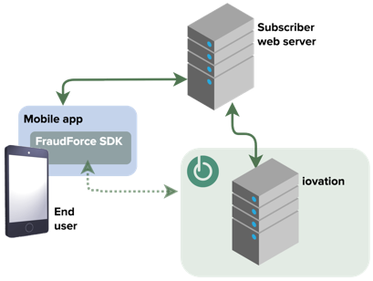
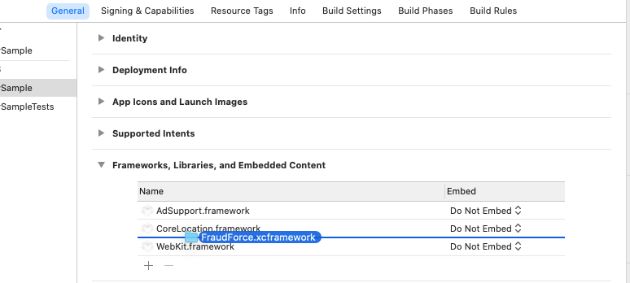

Title: TransUnion TruValidate Device Risk SDK for iOS

Device Risk SDK for iOS
===========================

## What is TruValidate Device Risk?

**FraudForce is now Device Risk. Our device-based products, such as Device Risk and Device-Based Authentication (formerly ClearKey), are critical components of our fraud and identity solutions; the new names make it easy to quickly understand our extensive capabilities. We have united these solutions under the TransUnion TruValidate brand. We have taken care not to update anything that might affect your implementations; as a result you'll still see legacy names in some places.**

--

TransUnion identifies devices through information collected by the Device Risk 
SDK run on an end-user’s mobile device. The SDK inspects the device
and generates a blackbox that contains all available device information. This
blackbox must then be sent to your servers to be used in a transaction risk
check via the `CheckTransactionDetails` API.

The Device Risk SDK integrates with native and hybrid apps. Hybrid apps
mix native code with content that runs inside web view.

Integration Files and Requirements
----------------------------------

|                     |                                                       |
|---------------------|-------------------------------------------------------|
| File                | `FraudForce.xcframework`                              |
| Version             | 5.3.0                                                 |
| Required OS Version | iOS 11.0 and higher                                   |
| Supported Devices   | iPhone 5S & up, iPod Touch 6th Gen & up, iPad Air & up|
| Required Frameworks | CoreTelephony, Security, SystemConfiguration          |
| Optional Frameworks | AdSupport, CoreLocation                               |

Installation
------------

### Swift Package Manager (Preferred)

Add the Swift Package through the Xcode UI as usual:

1. Select project in list of Targets.

2. Select the "Package Dependencies" pane.

3. Click the "+" button.

4. Enter this git repo's URL in the search bar.

5. Select the package from the results, and click "Add Package".

6. After Xcode resolves the package, select a target to add the library to.

7. Follow the remaining steps in the [Finishing Up](#finishing-up) section below.

### Manual

1.  Download and unzip the SDK from [Github](https://github.com/iovation/deviceprint-SDK-iOS/releases).

2.  Bring `FraudForce.xcframework` into your project repository.

3.  Drag and drop (or select the "+" button) to add the `FraudForce.xcframework` into the "Frameworks, Libraries, and Embedded Content" section of the "General" pane of the Xcode target editor.
     

    *   This should also result in `FraudForce.xcframework` being added to appropriate sections of the "Build Phases" pane ("Link Binary With Libraries" and "Embed Frameworks").

4. Follow the remaining steps in the [Finishing Up](#finishing-up) section below.

### Finishing Up

1.   Optionally add these frameworks (i.e. "Linked Frameworks and Libraries") if your app makes use of them (and Auto Linking is off):
    *   `AdSupport.framework` — If your app displays ads. Do not include if your
        app does not use the ad framework, because the App Store will reject
        apps that include the framework but don't use it or does not ask for permission from the user.
    *   `CoreLocation.framework` — If your app uses location monitoring. Do not
        include this framework unless your application requests geolocation
        permission from the user.

2.  If your app has enabled the "Keychain Sharing" capability:
    *   Add "com.iovation.stm" to its list of Keychain Groups
    *   Add the key `AppIdentifierPrefix` with the string value
        `$(AppIdentifierPrefix)` to your app's `Info.plist`.

3.   Allow Device Risk to collect wireless network information:
    *   Configure your app to include the "Access WiFi Information" capability.
        *   This capability is _optional_ but recommended (as it enables additional attribute collection). 
        *   Turning the capability on for your application target in Xcode will update the app's entitlements file and provisioning profile.

        
Upgrade from Universal to XCFramework Installation
------------

Versions 5.0.0 (2017) through 5.1.0 (2020) were distributed exclusively as a Universal framework. Version 5.2.0 introduced an optional XCFramework asset. Beginning with version 5.3.0, XCFramework is the exclusive distribution format for the Device Risk SDK. To update a project that had previously integrated a Universal framework version of Device Risk, follow these steps to uninstall the deprecated format.

1. In the "Frameworks, Libraries, and Embedded Content" section of the "General" pane of the Xcode target editor, remove `FraudForce.framework`.

2. In the "Build Phases" pane of the Xcode target editor, remove the formerly required Run Script phases related to the Universal version of the framework (which were named "Slim Frameworks For Build" and "Clean For Next Build" in prior documentation).
    * The XCFramework format seamlessly packages and allows Xcode to appropriately handle the multiple architectures required to support both Simulators and Devices.

3. Remove the "Post-actions" script from the "Archive" scheme of your application target (which was named "Archive Framework Symbols" in prior documentation).
    * From the target popup button in the Xcode toolbar, ensure your application target is selected and choose "Edit Scheme…" from the popup menu.
    * In the scheme editor, select the disclosure triangle for the "Archive" item and then select "Post-actions".
    * Remove the Run Script action responsible for including `.bcsymbolmap` files for Device Risk in the application archive.
        * The utility of `.bcsymbolmap` files continues to hold true for XCFramework-packaged, dynamic libraries (i.e. they are required to enable symbolication of Device Risk stack frames in the crash logs of subscriber apps). Now, these files are included inside of the `.xcframework` bundle and are appropriately handled by Xcode 12 and above.

4. Follow the Installation instructions (above) to integrate the XCFramework version of Device Risk.
    * Installation steps 4 - 6 should not need to be repeated given a proper installation of a recent version of Device Risk. 

Sample Projects
---------------

This download includes two sample Xcode projects that demonstrate the integration of the Device Risk 
SDK for iOS. These projects require at least Xcode 11 and iOS 11.0.

* The `iovSample/iovSampleSwift.xcodeproj` project uses Swift to demonstrate 
two integration techniques: UIKit and WebKit. Each is implemented in its own 
view controller, and may be tested in a tabbed interface on a simulator or device.

* The `iovSample/iovSample.xcodeproj` project uses Objective-C to demonstrate 
two integration techniques: UIKit and WebKit. Each is implemented in its own 
view controller, and may be tested in a tabbed interface on a simulator or device.

Usage
-----

Use the `FraudForce` API to enable the Device Risk SDK to start collecting blackbox
data asynchronously, and to generate a new blackbox to submit to your back-end service.

1.  Import it into your app delegate and call `+start` when the application
    becomes active:

        [FraudForce start];

    This method starts a low-priority thread that silently collects data from
    the device with minimal impact on your app.

2.  Include your "Subscriber Key" in your application's `Info.plist`, using the key `IOVSubKey`.

        <key>IOVSubKey</key>
        <string>6S7EJX4BM7HuKUmriUOuQvXta9mBUs4tAVtGToP6tUY=</string>

    This is strongly recommended for all integrations, and it is required for network connections.

3.  (optional) Provide a `FraudForceDelegate` object, which is required for network connections.

        - (BOOL)application:(UIApplication *)application didFinishLaunchingWithOptions:(NSDictionary *)launchOptions 
        {
            [FraudForce delegation:self];
    …

        - (BOOL)shouldEnableNetworkCalls
        {
            return YES;
        }

3.  To generate a new blackbox, call `+blackbox`:

        NSString *blackbox = [FraudForce blackbox];

4.  Submit the blackbox to your service. The service should then send
    it to TransUnion to evaluate the transaction. See the iovSample Xcode
    projects included with the download for a sample implementation.

### New Features! ###

Versions 5.0.0 and above include the ability to make a network call to TransUnion TruValidate's service. This 
enables the Device Risk SDK to collect additional network information. By default this functionality 
is turned off and will need to be enabled via a `FraudForceDelegate` object. Usage of this 
feature requires a subscriber key be provided. Please contact your TransUnion client representative to 
acquire a subscriber key.

### Important! ###

The blackbox returned from `+blackbox` should never be empty. An empty blackbox 
indicates there is a problem with the integration of the SDK or that the protection 
offered by the system may have been compromised.

Asynchronous Processing Integration
-----------------------------------

Each of the native and hybrid integration methods described below benefit
from starting the SDK asynchronous processing whenever your application
becomes active. To do so, import `FraudForce` and call `+start` in the
`-applicationDidBecomeActive:` method of your app delegate:

    #import "SampleAppDelegate.h"
    @import FraudForce;

    -applicationDidBecomeActive:(UIApplication *)application
    {
        [FraudForce start];
    }

The `+start` method automatically registers a notification handler to be
called when the application goes into the background. This handler asks the
OS for time to finish any tasks it has running.

Integrating Into Native Apps
----------------------------

To integrate into a native app using UIKit:

1.  Start the asynchronous data collection as described in the
    [Asynchronous Processing Integration] section.

1. Import `FraudForce` and call `+blackbox` wherever you need a blackbox:

        #import "SampleViewController.h"
        @import FraudForce;

        @implementation SampleViewController
        @property (strong, nonatomic) UILabel *blackbox;

        // Button press updates text field with blackbox value
        - (IBAction)changeMessage:(id)sender
        {
            self.blackbox.text = [FraudForce blackbox];
        }

        @end

A more extensive example, including submitting a blackbox in an HTTP request,
may be found in the `SampleUIKitViewController` class for both Swift (iovSampleSwift) and 
Objective-C (iovSample) in the sample Xcode projects included in the Device Risk SDK download.

WebKit Integration
------------------

For a hybrid application using [WebKit], create a JavaScript message handler
and add it to the context of the web view.

1.  Start the asynchronous data collection as described in the
    [Asynchronous Processing Integration] section.

2.  Build a view controller that implements the WKScriptMessageHandler
    protocol. Here’s an example in Swift:

        import UIKit
        import WebKit
        import FraudForce

        class SampleWebKitViewController: UIViewController, WKScriptMessageHandler
        {
            weak var webView: WKWebView?

            override func viewDidLoad() {
                super.viewDidLoad()
                // Set up Blackbox.injectInto() via a user script.
                var js = "var Blackbox = { injectInto: function (id) {\n"
                       + "    window.webkit.messageHandlers.bb.postMessage(id)\n"
                       + " } }\n"
                let userScript = WKUserScript(
                    source: js, 
                    injectionTime: .atDocumentEnd, 
                    forMainFrameOnly: true)

                // Set up bb notification.
                let userContentController = WKUserContentController()
                userContentController.addUserScript(userScript)
                userContentController.add(self, name: "bb")
                let configuration = WKWebViewConfiguration()
                configuration.userContentController = userContentController

                // Create the web view.
                let webKitView = WKWebView(frame: self.view.bounds, configuration: configuration)
                self.view.addSubview(webKitView)
                webKitView.translatesAutoresizingMaskIntoConstraints = true
                webKitView.autoresizingMask = [.flexibleHeight, .flexibleWidth]
                webView = webKitView
            }
        }

    In this example, we added a script handler called "bb" and appointed the
    view controller itself as the delegate. The `Blackbox.injectInto()`
    function calls into this handler.

3.  To hook up this script handler, add the following method to handle
    notifications from JavaScript running in the web view. This example
    assumes that an HTML ID for a hidden form field will be passed in the
    message body:

        func userContentController(
            _ userContentController: WKUserContentController,
            didReceive message: WKScriptMessage)
        {
            // Consider checking properties of message.webView.URL, such as the host
            // property, to ensure that it's a request from a known source.
            guard message.name == "bb" else {
                return
            }

            // Inject the blackbox.
            message.webView?.evaluateJavaScript(
                "document.getElementById('\(message.body)').value = '\(FraudForce.blackbox())'", 
                completionHandler: nil)
        }

    The last statement simply injects the blackbox from a call to
    `FraudForce.blackbox()` into the hidden form field. Consider adding code
    to check the domain and other attributes of the requesting web page to
    ensure it is allowed to have a blackbox.

4.  Then, invoke `FraudForce.injectinfo()` function any place in the HTML
    that you need a blackbox:

        <form name="txn" onsubmit="try { FraudForce.injectInto('bbox'); } catch(e) {} return true;">
            <input type="hidden" id="bbox" name="bbox" />
            <!-- Other fields as required --->
            <input type="submit" />
        </form>

    **NOTE:** The `try`/`catch` statement ignores errors if none of the
    `FraudForce.injectInto` object hierarchy exists. This is essential if
    the HTML will be used outside of your app.

5.  If you have full control over the HTML that will be loaded into
    WKWebView, including the name of a hidden field into which to inject a
    blackbox, append the code to inject the blackbox to the user script.
    Change the JavaScript variable declaration above to:

        var js = "var Blackbox = { injectInto: function (id) {\n"
               + "    window.webkit.messageHandlers.bb.postMessage(id)\n"
               + " } }\n"
               + "document.getElementById('bbox').value = '\(FraudForce.blackbox())'\n"

Find a complete example in the `SampleWKWebViewViewController` class for Swift (iovSampleSwift) and `SampleWebKitViewController` 
class for Objective-C (iovSample) in the sample Xcode projects included in the Device Risk SDK download.

[Intelligence Center]: https://admin.iovation.com/
[the SDK]: https://github.com/iovation/deviceprint-SDK-iOS
[Installation]: #installation
[Usage]: #usage
[Asynchronous Processing Integration]: #asynchronousprocessingintegration
[Integrating Into Native Apps]: #integratingintonativeapps
[WebKit]: https://developer.apple.com/documentation/webkit "WebKit Framework Reference"

Changes
-------

### v5.4.0 ###
* Add `Package.swift` for Swift Package Manager support.

### v5.3.0 ###
* Recognition improvements.
* Distribution is now exclusively XCFramework.
    * Includes support for simulators on M1 (arm64) Macs.
    * Updated sample projects to use `.xcframework`.
    * Removed (Universal framework) integration scripts.

### v5.2.0 ###
* Performance improvements.
* Improved handling of background tasks.
* OS requirement raised to iOS 11.
    * SDK supports 64-bit devices only.
* XCFramework artifact released.

### v5.1.0 ###
* Blackbox format improvements.
* Performance improvements.
* Addressed all "Main Thread Checker" complaints.
    * Additional protections silence extraneous warnings and streamline development in newer Xcode environments.
    * `FraudForce.blackbox` continues to be safe to call from any thread.
* Updated sample projects to resolve Xcode 11 build errors.

### v5.0.4 ###
* Improved thread safety.
* Updated integration scripts to support macOS Catalina.

### v5.0.3 ###
* SDK built with Xcode's "New Build System", the default as of Xcode 10.
* Updated sample projects. 

### v5.0.2 ###
* Minor recognition improvements.
* Updated the iovSample project (Objective-C) to the latest language, project, and system standards.
    * Removed the UIWebView integration sample.
* Minor improvements to the iovSampleSwift project.
* Note a new entitlement is recommended for apps built with Xcode 10 (and above). See the [Installation steps](#entitle-wireless) for details.

### v5.0.1 ###
* Minor recognition improvements.
    * Recognized devices previously returned (via `CheckTransactionDetails`) the following attributes
        * `mobile.app.procName`
        * `mobile.system.voipAllowed`
    * These values are no longer returned. In place of `mobile.app.procName`, use `mobile.app.exeName` which returns the same value.

### v5.0.0 ###
* New SDK distribution format, `FraudForce.framework` supersedes the `iovation.framework`.
  The new framework employs a dynamic library (in place of the historical "static archive" approach),
  which is the modern, recommended (iOS 8 and above), and more stable approach for library distribution.
* New ability to collect additional network information. See "New Features!" in the [Usage] section.
* New blackbox compression on iOS (up to 40% reduction in blackbox size).
* Improved Swift compatibility.
* New Swift sample project `iovSample/iovSampleSwift.xcodeproj`.
* Renamed `DevicePrint` class to `FraudForce`.
* Removed legacy `iovation` class (`+ioBegin`), which was deprecated and replaced in version 4.0.
* OS requirement raised to iOS 9.

### v4.3.0 ###
* Define the framework as a module, which removes integration obstacles for 
  Swift clients and improves the overall compatibility with current Xcode 
  build strategies.
* Deprecated the collection of device attributes that were dependent on the 
  ExternalAccessory framework (given restrictions to their availability in 
  recent versions of iOS).

### v4.2.0 ###
* Added support for bitcode apps.
* Dropped support for iOS 5, as required to support bitcode-enabled apps.
* Improved jailbreak detection.
* Improved cross-application device recognition for apps using a shared
  keychain. See the [Installation steps](#keychain-share) for details.

### v4.1.0 ###
* Minor updates for improved iOS 9 compatibility.
* Converted the iovSample WebKit demo class from Swift to Objective-C for
  better compatibility with new releases of Xcode.
* Minor recognition improvements.

### v4.0.0 ###
* New API, `DevicePrint`, handles low-priority asynchronous collection of
  device data. The old `iovation` class and `+ioBegin` method remain in place
  for backward compatibility.
* Now requires the SystemConfiguration framework.
* Expanded the iovSample project with classes demonstrating both native and
  hybrid implementations.
* Added WebKit and UIWebView integration instructions.
* Removed autolayout from the `iovSample.xcode5` project so that it can be
  compiled and run against iOS 5.

### v3.1.0 ###
* Collecting additional attributes to be used in forthcoming jailbreak
  business rule.

### v3.0.1 ###
* Updated and enhanced library compression. Binary size is now at 434K.

### v3.0.0 ###

* Now distributed as a framework instead of standalone .a and .h files.
* Collects additional device attributes and data.
* Restored collection of the advertising identifier, but only if your app
  includes the optional AdSupport framework.
* The CoreLocation framework is now optional; the SDK will not use it if it's
  not included in your app.
* Now require the ExternalAccessory and CoreTelephony frameworks.
* Added 64 bit support.
* Simplified the iovSample application code to more closely match current iOS
  SDK functionality.
* Added iPad and Retina display support to iovSample.

Copyright
---------

Copyright (c) 2010-2021 TransUnion. All rights reserved.
